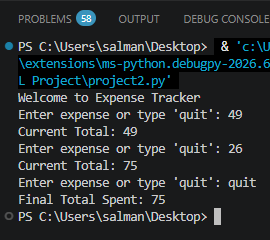

# Python Expense Tracker

A simple command-line Expense Tracker application built using Python. This project allows users to enter expenses, calculate the total amount spent, and practice Python fundamentals.

## Features

- Add daily expenses
- Calculate total expenses
- Simple command-line interface
- Easy to use

## Technologies Used

- Python 3

## How to Run

1. Download or clone this repository.
2. Open the project folder in VS Code.
3. Run the following command:

```bash
python project2.py
```

## Screenshot



## Example

```text
Enter expense: 250
Enter another expense: 300

Total Expense: 550
```

## 📚 What I Learned

- Variables
- User Input
- While Loops
- Arithmetic Operations
- Accumulator Variables
- Conditional Statements

## 👩‍💻 Author

Khadeeja Aqeel

Created as part of my Python learning journey.
